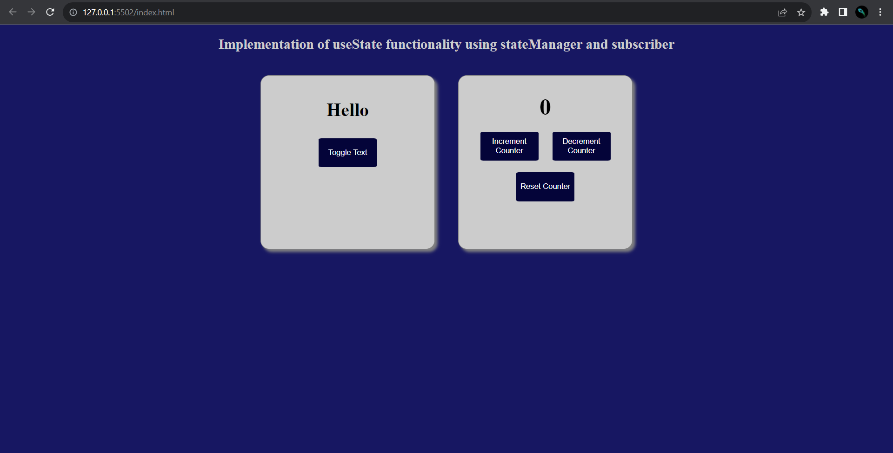

# Juspay-Assignment

Objective: To implement functionality similar to React useState hook without using React and only Vanilla Javascript.

_Features_

- It uses local storage to preserve the state
- It uses stateManager class and subscriber method
- Multiple state components are there

Screenshots:

In this project, we explore an approach to implementing a simple state management system without relying on external libraries or frameworks like React. We achieve this by utilizing the concept of subscriber methods to maintain the synchronization between the state and the user interface.

*The StateManager Class
The core of our approach is the StateManager class. This class encapsulates the state of our application and provides methods for updating, subscribing, and notifying subscribers about state changes.

*constructor(initialState): Initializes the state with the provided initialState and initializes an empty array for storing subscribers.
getState(): Returns the current state.
setState(newState): Updates the state, triggers the notifySubscribers() method to inform subscribers of the change, and persists the state in local storage for data persistence.

*subscribe(subscriber): Adds a subscriber (an instance of the Renderer class) to the list of subscribers.
unsubscribe(subscriber): Removes a subscriber from the list.

notifySubscribers(): Iterates through the list of subscribers and calls the update() method on each subscriber, passing the updated state.

*The Renderer Class:
The Renderer class is responsible for updating the user interface based on changes in the state. It receives updates from the StateManager and reflects those updates in the DOM.

*constructor(elementId, stateManager): Initializes a Renderer instance with the target DOM element identified by elementId. It subscribes itself to the provided stateManager.
*update(newState): Updates the content of the associated DOM element with the updated state.

*Event Listeners and Initial Render:
In the DOMContentLoaded event handler, we initialize our state manager with the value stored in local storage or a default value of 0. We also create a Renderer instance for the counter display. Additionally, we set up event listeners for the increment, decrement, and reset buttons to modify the state when clicked.

Finally, we perform an initial render by updating the renderer with the current counter value.

